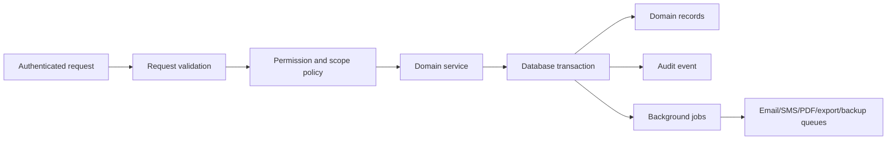
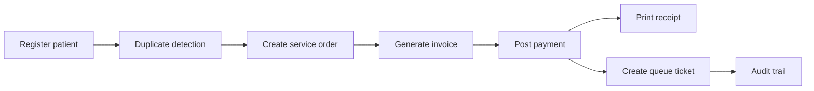
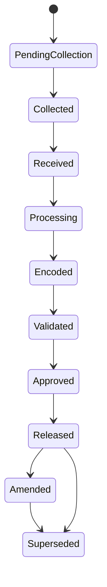
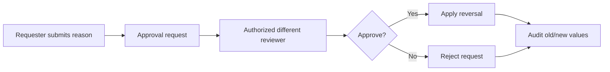

# HMS Production Technical Specification

Source: Hospital Management System Strong Production-Level Plan, v1.0, prepared May 08, 2026.

This document converts the production blueprint into implementation handoff material for backend, frontend, QA, DevOps, and product stakeholders.

Machine-readable handoff files:

- `api/production-openapi.json`: production API contract, required controls, request schemas, and response schemas.
- `docs/permission-matrix.json`: role/action/permission matrix with approval, reason, audit, and idempotency flags.
- `docs/deployment-runbook.md`: deployment, rollback, smoke test, and go/no-go runbook.
- `tests/production-coverage.test.js`: coverage checks that keep API groups, schema tables, dangerous-action controls, permission matrix rows, and runbook sections from drifting silently.

Executable backend foundation:

- `src/api/router.js`: dependency-free route adapter that maps production routes to service methods and enforces authentication plus idempotency headers.
- `src/api/server.js`: local HTTP server for API smoke testing.
- `src/core/passwords.js`: password hashing and verification helper; executable demo users store hashes only, and API responses never return password hashes.
- `src/services/hms-service.js`: service-layer workflows for patient registration, ordering, billing, LIS, inventory, reports, health, approvals, notification queuing, and audit logging.
- `src/infrastructure/in-memory-store.js`: development repository adapter. Production should replace this with transactional PostgreSQL repositories while preserving service contracts.
- `.github/workflows/ci.yml`: syntax and production test checks for pushes and pull requests.

## Architecture Standard

Controllers must not directly mutate business records. A write request should follow this path:



Required service modules:

- Authentication Service
- Permission Service
- Patient Service
- Appointment and Queue Service
- Order Service
- Billing Service
- LIS Service
- Inventory Service
- HR Service
- Notification Service
- Audit Service
- Approval Service
- Report Service
- Template Service
- File Service
- Settings Service
- Backup and System Health Service

## Tenant and Scope Rules

- Every tenant-owned record must be query-scoped by `tenant_id`.
- Branch-owned records must also be scoped by `branch_id`.
- Patient portal access must scope to the authenticated patient or authorized dependent only.
- API tokens must carry explicit scopes and tenant ownership.
- Cross-tenant reads, file access, report exports, and user lookups are production-blocking defects.

## API Groups

All write endpoints require request validation, permission checks, tenant/branch scoping, idempotency keys for high-risk writes, and audit logs where sensitive.

| Group | Example routes | Required controls |
| --- | --- | --- |
| `/auth` | `POST /login`, `POST /logout`, `POST /mfa/verify`, `POST /patient/otp` | rate limit, lockout, MFA/OTP audit |
| `/users` | `GET /users`, `POST /users`, `PATCH /users/:id/deactivate` | admin permission, reason, approval for role/access changes |
| `/roles` | `GET /roles`, `POST /roles/:id/permissions` | `admin.role.change`, approval, audit |
| `/patients` | `GET /patients`, `POST /patients`, `GET /patients/:id`, `PATCH /patients/:id`, `POST /patients/:id/archive`, `POST /patients/merge-requests` | patient permissions, duplicate detection, reason for identity edits |
| `/appointments` | `POST /appointments`, `PATCH /appointments/:id/reschedule`, `POST /appointments/:id/no-show` | patient/department scope, reminder jobs |
| `/queue` | `POST /queue`, `POST /queue/:id/call`, `POST /queue/:id/skip`, `POST /queue/:id/complete` | queue permission, queue event logging |
| `/orders` | `POST /orders`, `POST /orders/:id/cancel`, `POST /orders/:id/void-request` | price version locking, reason for cancel/void |
| `/billing` | `POST /invoices/:id/payments`, `POST /payments/:id/refund-request`, `POST /payments/:id/void-request`, `POST /cashier-sessions`, `POST /cashier-sessions/:id/close` | scoped idempotency, balance validation, maker-checker, cashier ownership, cashier reconciliation |
| `/lab` | `POST /lab-orders/:id/collect`, `POST /lab-orders/:id/receive`, `POST /lab-results/:id/encode`, `POST /lab-results/:id/validate`, `POST /lab-results/:id/approve`, `POST /lab-results/:id/release`, `POST /lab-results/:id/amend-request` | status engine, chain of custody, dual approval, result locking |
| `/inventory` | `POST /receiving`, `POST /stock-movements`, `POST /stock-adjustments`, `POST /physical-counts` | batch/expiry validation, expired issue block, approval |
| `/hr` | `POST /employees`, `POST /employees/:id/offboard`, `POST /leave-requests`, `POST /payroll-exports` | HR scope, access revocation, approval |
| `/reports` | `GET /reports/:code`, `POST /reports/:code/export` | export permission, reason for sensitive exports, background job |
| `/notifications` | `POST /notifications/send`, `POST /notifications/:id/retry` | privacy-safe templates, provider logs |
| `/admin` | `GET /settings`, `PATCH /settings`, `POST /backups`, `POST /restore-requests`, `GET /health` | dangerous-action approval, backup audit |
| `/audit` | `GET /audit-logs` | audit permission, masked lower-privilege views |

## Request and Response Rules

### High-risk write headers

```http
Idempotency-Key: <uuid>
X-Branch-Id: <branch uuid>
```

Use idempotency keys for payments, refunds, voids, result release, inventory movements, imports, exports, and backup/restore operations. Idempotency cache scope must include tenant, branch, user, method, concrete path, route pattern, operation, and raw key so one user, route, tenant, or branch cannot receive another operation's cached response.

### Error shape

```json
{
  "error": {
    "code": "permission_denied",
    "message": "You do not have permission to approve this request.",
    "request_id": "req_123"
  }
}
```

Never expose raw database errors or stack traces to users.

## Permission Matrix

| Action | Permission | Receptionist | Cashier | Med-Tech | Pathologist | Manager | HR | Admin |
| --- | --- | --- | --- | --- | --- | --- | --- | --- |
| Register patient | `patient.create` | Yes | No | No | No | Yes | No | Yes |
| Create order | `order.create` | Yes | No | Limited | Yes | Yes | No | Yes |
| Accept payment | `billing.payment.create` | No | Yes | No | No | Yes | No | Yes |
| Void payment | `billing.payment.void.request` / `billing.payment.void.approve` | No | Request | No | No | Approve | No | Approve |
| Refund payment | `billing.refund.request` / `billing.refund.approve` | No | Request | No | No | Approve | No | Approve |
| Encode lab result | `lab.result.encode` | No | No | Yes | No | No | No | Yes |
| Approve lab result | `lab.result.approve` | No | No | No | Yes | No | No | Yes |
| Amend released result | `lab.result.amend.request` / `lab.result.amend.approve` | No | No | Request | Approve | No | No | Approve |
| Manage employees | `hr.employee.update` | No | No | No | No | Limited | Yes | Yes |
| Export reports | `report.export` | No | Limited | No | Limited | Yes | Limited | Yes |
| Change roles | `admin.role.change` | No | No | No | No | No | No | Yes |

## Workflow Diagrams

### Patient to payment



### Laboratory result lifecycle



### Refund and void approval



## UI Production Requirements

- Patient-related screens must display the patient identity header.
- Tables require search, filters, status badges, pagination, safe exports, and action dropdowns.
- Long workflows use pages, not modals.
- Dangerous actions require permission, confirmation, reason, audit, and approval when configured.
- Buttons must disable during submission in production to prevent duplicate writes.
- Empty, loading, denied, and failure states are part of the acceptance criteria.

## Deployment Acceptance Gates

A release cannot proceed unless all gates pass:

- Database migration reviewed and reversible.
- Backup taken and restore procedure documented.
- Smoke tests pass for login, billing, queue, result print, report export, email/SMS, and permissions.
- Audit events verified for sensitive workflows.
- Cashier closing reconciles with payment reports.
- Result release locks documents and QR verification exposes only masked authenticity details.
- Failed jobs, queue workers, backup status, storage, and integration status visible on health page.

## Production Test Matrix

| Area | Required tests |
| --- | --- |
| Auth | MFA roles, lockout, logout audit, patient OTP |
| Permission | every sensitive action denied for wrong roles |
| Patient | duplicate detection, archive reason, merge approval |
| Billing | partial/mixed payment, overpayment block, void/refund approval, locked paid invoice |
| Cashier | closing totals, short/over, manager approval |
| LIS | result status lifecycle, dual approval, amendment versioning, QR masking |
| Inventory | receiving fields, expired issue block, adjustment approval, physical count variance |
| Files | private access, type/size validation, signed URLs, download audit |
| Reports | permission, filters, export audit, large export background job |
| Backup | encrypted backup, restore test record, restore approval |
